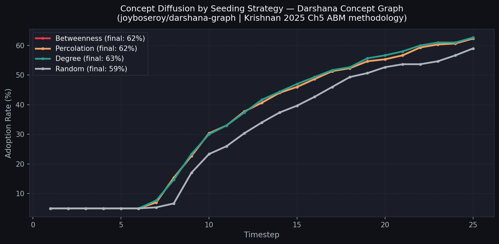
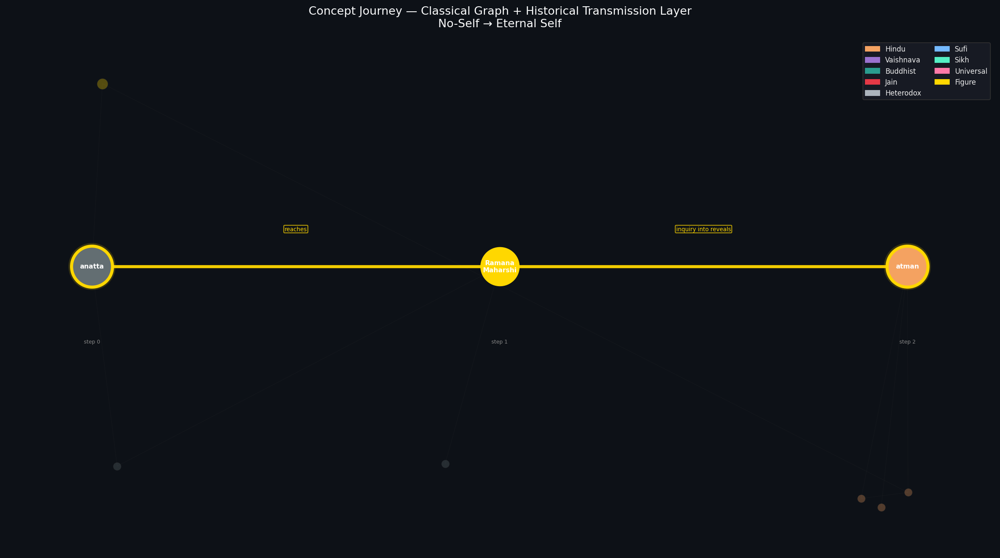
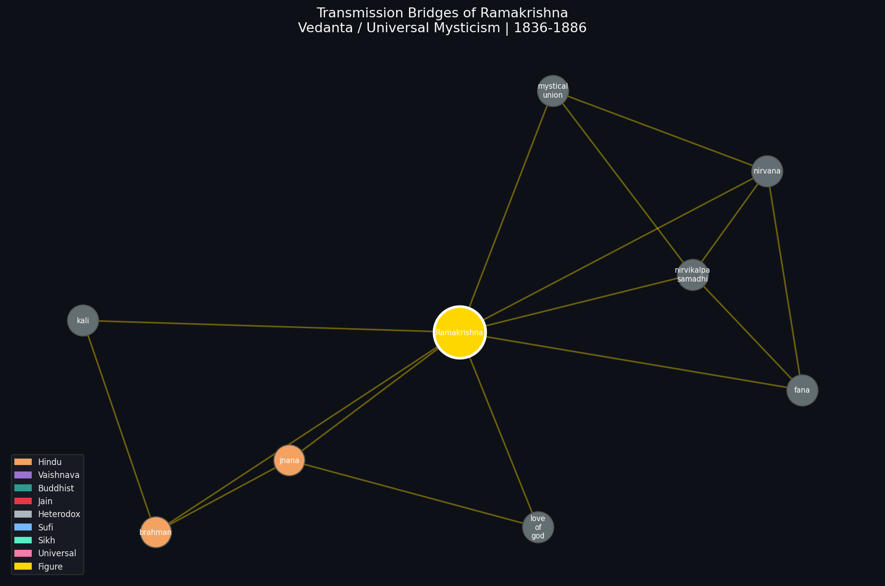

# agentic-diffusion-sim

**How do ideas travel across religions? We built a network analysis and simulation to find out.**

This repository applies graph science and agent-based modeling to the [darshana-graph](https://huggingface.co/datasets/joyboseroy/darshana-graph), a dataset of 28,322 documented philosophical relationships across Hindu, Buddhist, and Jain traditions. Using betweenness centrality, shortest-path traversal, and diffusion simulation, we trace how concepts travel across traditions and which historical figures acted as the critical bridges.


*The shortest path from Buddhist emptiness (sunyata) to Krishna Consciousness, stepping through the actual concepts and historical figures that connect them.*

---

## The Core Question

If a new syncretic idea enters the philosophical network at one tradition, how far does it travel? Which concepts carry it across tradition boundaries? And which historical figures were the actual bridges?

We answer this through three tools applied to the same graph:

- **Betweenness centrality analysis** to identify which concepts are the structural highway junctions
- **Shortest-path traversal** to find the actual routes between traditions
- **Agent-based diffusion simulation** to model how belief spreads dynamically over time

The centrality and path-finding results are the primary contribution. The simulation adds a dynamic lens, using a four-stage belief update model drawn from social network diffusion research (Krishnan, 2025).

---

## Key Findings

**Finding 1: Brahman dominates the entire network.**

Every one of the top 25 concepts by betweenness centrality is Hindu. Brahman scores 0.38, nearly double the second-place concept (atman at 0.23). No Buddhist, Jain, or Sufi concept appears in the top 25. Any idea that wants to travel cross-tradition has to pass through Vedantic vocabulary first.

This reflects both the historical dominance of Advaita Vedanta in Indian philosophical discourse and the relative abundance of digitized Sanskrit texts compared to Pali or Tibetan sources. Both factors are real and worth acknowledging.

**Finding 2: The shortest paths between traditions are historically meaningful.**

| Journey | Steps | Route |
|---|---|---|
| sunyata to krsna consciousness | 2 | sunyata → maya → krsna consciousness |
| anatta to atman | 2 | anatta → [Ramana Maharshi] → atman |
| fana to krsna consciousness | 3 | fana → [Ramakrishna] → brahman → krsna consciousness |
| nirvana to lila | 4 | nirvana → [Aurobindo] → consciousness → [Prabhupada] → lila |
| ik onkar to nirvana | 3 | ik onkar → brahman → samadhi → nirvana |
| choiceless awareness to brahman | 3 | choiceless awareness → [Krishnamurti] → maya → brahman |

These paths correspond to actual historical transmission routes. The figures in brackets are the people who carried ideas across traditions in real time.

**Finding 3: Ramakrishna is the most central bridge figure.**

In the combined graph including 24 historical figures, Ramakrishna is one step from nirvana, one step from fana, and one step from brahman simultaneously. He practised Hindu Tantra, Advaita Vedanta, Vaishnavism, Islam, and Christianity personally, making him the most structurally central figure in the entire transmission network.

**Finding 4: Diffusion simulation confirms centrality-based seeding outperforms random.**

On the full 2,349-concept graph after 25 steps:

| Strategy | Final Adoption |
|---|---|
| Betweenness | 62.6% |
| Percolation | 62.6% |
| Degree | 62.5% |
| Random | 58.4% |

Seeding at structural hubs reaches approximately 4 percentage points more of the network than random seeding. The cascade follows a classic S-curve: slow awareness buildup, sudden tipping point, gradual plateau.

---

## Two Layers

**Layer 1: Classical concept graph.** Built from the darshana-graph dataset. Nodes are philosophical concepts. Edges are documented relationships between concepts, weighted by frequency. Covers 2,349 concepts and 3,858 unique edges across Hindu, Buddhist, Jain, and other traditions.

**Layer 2: Historical transmission layer.** A hand-curated dataset of 24 historical figures spanning Nagarjuna (2nd century) to Chogyam Trungpa (20th century). Each figure is a node connected to the concepts they bridged across traditions. This layer allows paths to route through the actual people who carried ideas from one tradition to another in historical time.

The 24 figures: Nagarjuna, Patanjali, Shankara, Ramanuja, Madhva, Kabir, Guru Nanak, Chaitanya, Rumi, Ram Mohan Roy, Debendranath Tagore, Keshab Chandra Sen, Ramakrishna, Vivekananda, Helena Blavatsky, Henry Olcott, Annie Besant, Ramana Maharshi, Aurobindo, Aldous Huxley, Jiddu Krishnamurti, Alan Watts, Chogyam Trungpa, Prabhupada.

---

## Repo Structure

```
agentic-diffusion-sim/
├── run_sim.py                        # Entry point for generic diffusion simulation
├── transmission_layer.json           # 24 historical figures, 155 hand-curated edges
├── agents/
│   └── belief_agent.py               # Agent class with math and optional LLM modes
├── network/
│   └── generator.py                  # Graph generation and centrality targeting
├── simulation/
│   └── diffusion.py                  # Simulation loop
├── visualization/
│   └── animate.py                    # Adoption curves, stage flow, network plots
├── notebooks/
│   ├── darshana_diffusion_v2.py      # Main darshana simulation (concept-level graph)
│   ├── darshana_path_viz.py          # Path finder on classical graph only
│   ├── darshana_transmission_viz.py  # Full two-layer path finder and animator
│   └── darshana_diffusion_standalone.py  # Standalone single-file version
└── examples/                         # Sample outputs
```

---

## Usage

**Install dependencies:**
```bash
pip install networkx matplotlib datasets --break-system-packages
```

**Run the generic simulation (no data download needed):**
```bash
python3 run_sim.py                              # compare all 4 strategies
python3 run_sim.py --scenario enterprise        # enterprise AI adoption
python3 run_sim.py --scenario dharma            # dharma practice diffusion
```

**Run the darshana analysis (downloads ~10MB from HuggingFace):**
```bash
# Which concepts are the highway junctions?
python3 notebooks/darshana_diffusion_v2.py --top_concepts

# Seed a specific concept and watch it spread
python3 notebooks/darshana_diffusion_v2.py --seed_concept brahman --steps 30

# Compare all 4 seeding strategies
python3 notebooks/darshana_diffusion_v2.py --compare --steps 25
```

**Find and animate paths between traditions:**
```bash
# List all 24 historical figures
python3 notebooks/darshana_transmission_viz.py --list_figures

# Animate a specific journey
python3 notebooks/darshana_transmission_viz.py --from sunyata --to "krsna consciousness" --animate
python3 notebooks/darshana_transmission_viz.py --from fana --to "krsna consciousness" --animate
python3 notebooks/darshana_transmission_viz.py --from anatta --to atman --animate

# Show a figure's ego-network (who they bridged)
python3 notebooks/darshana_transmission_viz.py --show_figure Ramakrishna
python3 notebooks/darshana_transmission_viz.py --show_figure Vivekananda
python3 notebooks/darshana_transmission_viz.py --show_figure "Alan Watts"

# Distance matrix between all landmark concepts
python3 notebooks/darshana_transmission_viz.py --all_paths

# Run all 9 preset journeys as static images
python3 notebooks/darshana_transmission_viz.py --preset
```

**Optional LLM mode (Groq API key required):**
```bash
export GROQ_API_KEY=your_key_here
python3 run_sim.py --strategy betweenness --llm --nodes 20 --steps 5
```

---

## Sample Outputs



*Adoption curves for four seeding strategies on the darshana concept graph. Centrality-based seeding consistently outperforms random seeding.*



*Two steps from Buddhist no-self to Hindu eternal self, through Ramana Maharshi.*



*Ramakrishna's node touches nirvikalpa samadhi, fana, mystical union, nirvana, brahman, and kali simultaneously. He is the highest-betweenness figure in the transmission layer.*

---

## Related Projects

| Project | Connection |
|---|---|
| [darshana-graph](https://github.com/joyboseroy/darshana-graph) | The source dataset (arXiv:2606.18222) |
| [digital-buddhism](https://github.com/joyboseroy/digital-buddhism) | Earlier network analysis of Buddhist teacher co-presence on Reddit |
| [vada-simulator](https://github.com/joyboseroy/vada-simulator) | Multi-agent philosophical debate engine using FalkorDB and LangGraph |
| [bengal-dharma-corpus](https://github.com/joyboseroy/bengal-dharma-corpus) | Computational study of lexical transmission across Bengali traditions |
| [falkor-irac](https://github.com/joyboseroy/falkor-irac) | Graph-RAG legal reasoning using the same network science approach |

---

## Data

The darshana-graph dataset: [joyboseroy/darshana-graph](https://huggingface.co/datasets/joyboseroy/darshana-graph)

The transmission layer (24 figures, 155 edges): `transmission_layer.json` in this repo

---

## Citation

```bibtex
@software{bose2026agentic,
  author = {Bose, Joy},
  title = {agentic-diffusion-sim: Philosophical Concept Diffusion across Indian Traditions},
  year = {2026},
  url = {https://github.com/joyboseroy/agentic-diffusion-sim}
}

@dataset{bose2025darshana,
  author = {Bose, Joy},
  title = {darshana-graph: A Knowledge Graph of Indian Philosophy},
  year = {2025},
  url = {https://huggingface.co/datasets/joyboseroy/darshana-graph}
}

@phdthesis{krishnan2025essays,
  author = {Krishnan, Nanjundi Karthick},
  title = {Essays in Social Networks, Behavior Change and Technology Adoption},
  school = {University of Michigan},
  year = {2025},
  url = {https://hdl.handle.net/2027.42/199303}
}
```

---

## Medium Article

[How Ideas Travel Across Religions: A Computational Journey Through 2,000 Years of Indian Philosophy](https://joyboseroy.medium.com/how-ideas-travel-across-religions-a-computational-journey-through-2000-years-of-indian-philosophy-ce91b089e888)*
